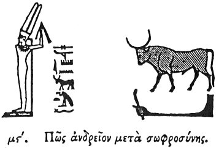

  
[Intangible Textual Heritage](../../index)  [Egypt](../index) 
[Index](index)  [Previous](hh047)  [Next](hh049) 

------------------------------------------------------------------------

[Buy this Book at
Amazon.com](https://www.amazon.com/exec/obidos/ASIN/1428631488/internetsacredte)

------------------------------------------------------------------------

*Hieroglyphics of Horapollo*, tr. Alexander Turner Cory, \[1840\], at
Intangible Textual Heritage

------------------------------------------------------------------------

### XLVI. HOW MANLINESS COMBINED WITH TEMPERANCE.

  [1](#fn_76)

To denote *manliness combined with temperance*, they

p. 67

delineate a BULL that has a vigorous constitution. Calidissimum enim est
huic animali membrum, ita ut semel eo in fœminæ vulvam immisso, vel
absque ullo motu semen effutiat. Quod si quando a vulvâ vaccæ aberrans,
in alium corporis partem membrum intenderit, tum ejus immodicâ
intentione vaccani vulnerat. Quin et temperans est: quippe cum nunquam
post conceptum, vaccam ineat.

------------------------------------------------------------------------

### Footnotes

[66:1](hh048.htm#fr_78)

I. *The commencement of numerous dedicatory inscriptions, generally
interpreted* "*Sacred*."—Sh. 309, 311. *Does it signify things, or a
tablet to* "*set up to, or in honour of?*"

II\. KHEM, *one of the principal divinities, the god of generation, his
emblem was the bull*.

III\. *Powerful*. Compare the translation of the obelisk of Hermapion,
Anc. Fr. p. 169, with the square banners of the kings.

------------------------------------------------------------------------

[Next: XLVII. How Hearing](hh049)
