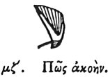

  
[Intangible Textual Heritage](../../index)  [Egypt](../index.md) 
[Index](index)  [Previous](hh048)  [Next](hh050.md) 

------------------------------------------------------------------------

[Buy this Book at
Amazon.com](https://www.amazon.com/exec/obidos/ASIN/1428631488/internetsacredte.md)

------------------------------------------------------------------------

*Hieroglyphics of Horapollo*, tr. Alexander Turner Cory, \[1840\], at
Intangible Textual Heritage

------------------------------------------------------------------------

### XLVII. HOW HEARING.

  [1](#fn_77.md)

To denote *hearing*, they delineate the EAR OF THE BULL,

p. 68

for when the cow is desirous of conception, (and she continues so for
not longer than three hours together,) she vehemently lows, and if
during this time the bull should not approach her, she reserves herself
till another meeting. This however rarely happens; for the bull hears
her from a great distance, and knowing that she is inflamed, he hastens
to the meeting, and is the only animal that does so.

------------------------------------------------------------------------

### Footnotes

[67:1](hh049.htm#fr_79.md)

*The bull's ear denotes hearing*.—Champ.

------------------------------------------------------------------------

[Next: XLVIII. How the Member of a Prolific Man](hh050.md)
