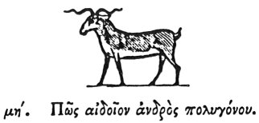

  
[Intangible Textual Heritage](../../index)  [Egypt](../index.md) 
[Index](index)  [Previous](hh049)  [Next](hh051.md) 

------------------------------------------------------------------------

[Buy this Book at
Amazon.com](https://www.amazon.com/exec/obidos/ASIN/1428631488/internetsacredte.md)

------------------------------------------------------------------------

*Hieroglyphics of Horapollo*, tr. Alexander Turner Cory, \[1840\], at
Intangible Textual Heritage

------------------------------------------------------------------------

  [1](#fn_78.md)

### XLVIII. HOW THE MEMBER OF A PROLIFIC MAN.

To denote the *member of a prolific man*, they depict a

p. 69

GOAT, and not a bull: ille enim antequam annum attigerit, coire non
solet: hic septem statim post ortum diebus congreditur, infœcundum et
genituræ minime accommodum semen excernens. Prius tamen ac celerius
cæteris animantibus coit.

------------------------------------------------------------------------

### Footnotes

[68:1](hh050.htm#fr_80.md)

*The Mendesian goat appears to have been considered by Herodotus as
sacred to Khem. The goat as well as the bull was an emblem of Siva*.

------------------------------------------------------------------------

[Next: XLIX. How They Denote Impurity](hh051.md)
