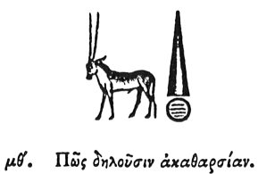

  
[Intangible Textual Heritage](../../index)  [Egypt](../index) 
[Index](index)  [Previous](hh050)  [Next](hh052) 

------------------------------------------------------------------------

[Buy this Book at
Amazon.com](https://www.amazon.com/exec/obidos/ASIN/1428631488/internetsacredte)

------------------------------------------------------------------------

*Hieroglyphics of Horapollo*, tr. Alexander Turner Cory, \[1840\], at
Intangible Textual Heritage

------------------------------------------------------------------------

### XLIX. HOW THEY DENOTE IMPURITY.

  [1](#fn_79)

To denote impurity, they delineate an ORYX [2](#fn_80) (a species of wild goat), because when

p. 70

the moon rises, this animal looks intently towards the goddess and
raises an outcry, and that, neither to praise nor welcome her; and of
this the proof is most evident, for it scrapes up the earth with its
fore legs, and fixes its eyes in the earth, as if indignant and
unwilling to behold the rising of the goddess. And it acts in the same
manner at the rising of (the divine star) the sun. Wherefore the ancient
kings, when the Horoscopus apprised them of the rising of the moon,
placed themselves near this animal, and by observing the middle of its
operations, ascertained, as by a kind of gnomon, the exact time of the
rising. And hence the priests, of all other cattle, eat this alone
without being previously marked with the seal, inasmuch as it appears to
entertain a kind of aversion to the

p. 71

goddess: and in the desert wherever it finds a watering place, after
having drunk, it stirs it up with its lips, and mingles the mud with the
water, and throws dust into it with its feet, that it may be fit for no
other animal to drink; so malicious and odious has the nature of the
Oryx been considered. Nor does it act thus unmeaningly, because it is
this same goddess who germinates and causes all things whatsoever to
increase that are useful in the world.

------------------------------------------------------------------------

### Footnotes

[69:1](hh051.htm#fr_81)

I. *The Oryx is found upon the monuments, but not explained*.

II\. *A conical seal frequently appears in the hands of persons making
oblations. Several with inscriptions on the base, as represented above,
are in Dr. Lee's Museum*.

[69:2](hh051.htm#fr_82) Moe. Pur A. B. Mer.
Causs. ὄρτυγα, a quail.

------------------------------------------------------------------------

[Next: L. How a Disappearance](hh052)
