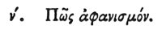

  
[Intangible Textual Heritage](../../index)  [Egypt](../index) 
[Index](index)  [Previous](hh051)  [Next](hh053) 

------------------------------------------------------------------------

[Buy this Book at
Amazon.com](https://www.amazon.com/exec/obidos/ASIN/1428631488/internetsacredte)

------------------------------------------------------------------------

*Hieroglyphics of Horapollo*, tr. Alexander Turner Cory, \[1840\], at
Intangible Textual Heritage

------------------------------------------------------------------------

### L. HOW A DISAPPEARANCE.

 

To denote a disappearance, they delineate a MOUSE [1](#fn_81), because

p. 72

it pollutes and spoils all things by nibbling them. They also make use
of the same symbol when they would denote discernment, for when many
different sorts of bread lie before him, the mouse selects the purest
from among them and eats it. And hence the selection by the bakers is
guided by mice.

------------------------------------------------------------------------

### Footnotes

[71:1](hh052.htm#fr_83)

*No hieroglyphic of a mouse has yet been found. But Herodotus states,
that when Sennacherib approached Egypt, the bowstrings of his army were
destroyed by mice during the night, in consequence of which, he was
defeated by Sethos, king of Egypt, to whom was erected a statue with a
mouse in his hand, as an emblem of* DESTRUCTION.

------------------------------------------------------------------------

[Next: LI. How Impudence](hh053)
