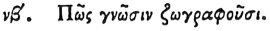

  
[Intangible Textual Heritage](../../index)  [Egypt](../index.md) 
[Index](index)  [Previous](hh053)  [Next](hh055.md) 

------------------------------------------------------------------------

[Buy this Book at
Amazon.com](https://www.amazon.com/exec/obidos/ASIN/1428631488/internetsacredte.md)

------------------------------------------------------------------------

*Hieroglyphics of Horapollo*, tr. Alexander Turner Cory, \[1840\], at
Intangible Textual Heritage

------------------------------------------------------------------------

### LII. HOW THEY REPRESENT KNOWLEDGE.

 

To represent *knowledge*, they delineate an ANT, for

p. 73

whatever a man may carefully conceal, this creature obtains a knowledge
of: and not for this reason only, but also because beyond all other
animals when it is providing for itself its winter's food, it never
deviates from its home, but arrives at it unerringly.

------------------------------------------------------------------------

[Next: LIII. How They Represent a Son](hh055.md)
