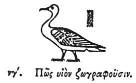

  
[Intangible Textual Heritage](../../index)  [Egypt](../index.md) 
[Index](index)  [Previous](hh054)  [Next](hh056.md) 

------------------------------------------------------------------------

[Buy this Book at
Amazon.com](https://www.amazon.com/exec/obidos/ASIN/1428631488/internetsacredte.md)

------------------------------------------------------------------------

*Hieroglyphics of Horapollo*, tr. Alexander Turner Cory, \[1840\], at
Intangible Textual Heritage

------------------------------------------------------------------------

### LIII. HOW THEY REPRESENT A SON.

  [1](#fn_82.md)

When they would denote a *son*, they delineate a CHENALOPEX (a species
of goose). For this animal is excessively fond of its offspring, and if
ever it is pursued so as to be in danger of being taken with its young,
both the father and mother voluntarily give themselves up to the
pursuers, that

p. 74

their offspring may be saved; and for this reason the Egyptians have
thought fit to consecrate this animal.

------------------------------------------------------------------------

### Footnotes

[73:1](hh055.htm#fr_84.md)

I. *The Goose signifies a Son; and with the globe, Son of the Sun, the
common title of the Pharaoh*.

------------------------------------------------------------------------

[Next: LIV. How a Fool](hh056.md)
