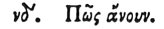

  
[Intangible Textual Heritage](../../index)  [Egypt](../index) 
[Index](index)  [Previous](hh055)  [Next](hh057) 

------------------------------------------------------------------------

[Buy this Book at
Amazon.com](https://www.amazon.com/exec/obidos/ASIN/1428631488/internetsacredte)

------------------------------------------------------------------------

*Hieroglyphics of Horapollo*, tr. Alexander Turner Cory, \[1840\], at
Intangible Textual Heritage

------------------------------------------------------------------------

### LIV. HOW A FOOL.

 

When they depict a PELICAN, they signify both a *fool*, and an *idiot*,
because although like other winged creatures it is able to deposit its
eggs on the higher places, it does not, but it merely scrapes up the
earth and there lays its eggs. And the people observing this, surround
the place with dried cows’ dung, to which they apply fire. And when the
pelican sees the smoke, by endeavouring to extinguish the fire with its
wings, she on the contrary kindles it by their motion: and thus, her
wings being burnt by the fire, she easily becomes a prey for the

p. 75

fowlers. And because it enters into the contest simply for the sake of
its young, the priests consider it unlawful to eat it. But the rest of
the Egyptians eat it, alleging that the pelican does not enter into the
contest with discretion, as do the geese, but with folly.

------------------------------------------------------------------------

[Next: LV. How They Represent Gratitude](hh057)
