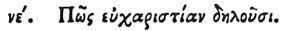

  
[Intangible Textual Heritage](../../index)  [Egypt](../index.md) 
[Index](index)  [Previous](hh056)  [Next](hh058.md) 

------------------------------------------------------------------------

[Buy this Book at
Amazon.com](https://www.amazon.com/exec/obidos/ASIN/1428631488/internetsacredte.md)

------------------------------------------------------------------------

*Hieroglyphics of Horapollo*, tr. Alexander Turner Cory, \[1840\], at
Intangible Textual Heritage

------------------------------------------------------------------------

### LV. HOW THEY REPRESENT GRATITUDE.

  [1](#fn_83.md)

To represent *gratitude*, they delineate a CUCUPHA, because this is the
only one of dumb animals, which, after it has been brought up by its
parents,

p. 76

repays their kindness to them when they are old. For it makes them a
nest in the place where it was brought up by them, and trims their
wings, and brings them food, till the parents acquire a new plumage, and
are able to assist themselves: whence it is that the Cucupha is honored
by being placed as an ornament upon the sceptres of the gods.

------------------------------------------------------------------------

### Footnotes

[75:1](hh057.htm#fr_85.md)

*The top of the sceptre placed in the hands of the gods is ornamented
with a crated head which appears to be that of some beast, but was
evidently considered by Horapollo to be the Hoopoo of Egypt*. See Ch. 8.
and title page.

------------------------------------------------------------------------

[Next: LVI. How an Unjust and Ungrateful Man](hh058.md)
