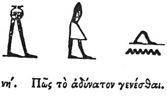

  
[Intangible Textual Heritage](../../index)  [Egypt](../index.md) 
[Index](index)  [Previous](hh059)  [Next](hh061.md) 

------------------------------------------------------------------------

[Buy this Book at
Amazon.com](https://www.amazon.com/exec/obidos/ASIN/1428631488/internetsacredte.md)

------------------------------------------------------------------------

*Hieroglyphics of Horapollo*, tr. Alexander Turner Cory, \[1840\], at
Intangible Textual Heritage

------------------------------------------------------------------------

### LVIII. HOW AN IMPOSSIBILITY.

  [1](#fn_85.md)

To signify an *impossibility*, they represent A MAN'S FEET WALKING ON
THE WATER; or when they would signify the same thing differently, they
delineate A HEADLESS MAN WALKING. And since these are both
impossibilities, they have with good reason selected them for this
purpose.

------------------------------------------------------------------------

### Footnotes

[79:1](hh060.htm#fr_87.md)

Well known hieroglyphics not yet interpreted. The second is from the
ceiling of the Ramesseion.

------------------------------------------------------------------------

[Next: LIX. How a Very Bad King](hh061.md)
