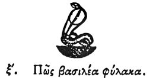

  
[Intangible Textual Heritage](../../index)  [Egypt](../index.md) 
[Index](index)  [Previous](hh061)  [Next](hh063.md) 

------------------------------------------------------------------------

[Buy this Book at
Amazon.com](https://www.amazon.com/exec/obidos/ASIN/1428631488/internetsacredte.md)

------------------------------------------------------------------------

*Hieroglyphics of Horapollo*, tr. Alexander Turner Cory, \[1840\], at
Intangible Textual Heritage

------------------------------------------------------------------------

p. 81

### LX. HOW A VIGILANT KING.

 

And otherwise to denote a *vigilant king*, they depict the SERPENT (UPON
THE WATCH), and in the place of the king's name they depict a watcher:
for he is the guardian of the whole world; and the king ought to be
vigilant everywhere.

------------------------------------------------------------------------

[Next: LXI. How They Designate a Ruler of the World](hh063.md)
