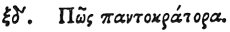

  
[Intangible Textual Heritage](../../index)  [Egypt](../index) 
[Index](index)  [Previous](hh065)  [Next](hh067) 

------------------------------------------------------------------------

[Buy this Book at
Amazon.com](https://www.amazon.com/exec/obidos/ASIN/1428631488/internetsacredte)

------------------------------------------------------------------------

*Hieroglyphics of Horapollo*, tr. Alexander Turner Cory, \[1840\], at
Intangible Textual Heritage

------------------------------------------------------------------------

### LXIV. HOW ONE WHO GOVERNS ALL THINGS. [1](#fn_89)

  [1](#fn_89)

They symbolize *one who governs all things* by the perfect

p. 84

form of the same animal, again depicting the ENTIRE SERPENT: for amongst
them it is the spirit that pervades the universe.

------------------------------------------------------------------------

### Footnotes

[83:1](hh066.htm#fr_92) See the winged globe and
serpent in the frontispiece. which is called Agathodæmon, und is said to
signify the spirit that pervades the universe. See also the Egg and
Serpent in Pl. I.

------------------------------------------------------------------------

[Next: LXV. How a Fuller](hh067)
