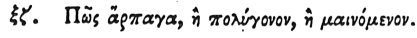

  
[Intangible Textual Heritage](../../index)  [Egypt](../index.md) 
[Index](index)  [Previous](hh068)  [Next](hh070.md) 

------------------------------------------------------------------------

[Buy this Book at
Amazon.com](https://www.amazon.com/exec/obidos/ASIN/1428631488/internetsacredte.md)

------------------------------------------------------------------------

*Hieroglyphics of Horapollo*, tr. Alexander Turner Cory, \[1840\], at
Intangible Textual Heritage

------------------------------------------------------------------------

### LXVII. HOW A RAPACIOUS, OR PROLIFIC, OR FURIOUS MAN.

 

When they would symbolize a *rapacious*, or *prolific*, or *furious
man*, they delineate a CROCODILE, because it is prolific \[?\], and
fertile in offspring, and furious. For if it fails in its intention of
seizing any thing it rages in anger against itself.

------------------------------------------------------------------------

[Next: LXVIII. How Sunrise](hh070.md)
