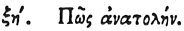

  
[Intangible Textual Heritage](../../index)  [Egypt](../index) 
[Index](index)  [Previous](hh069)  [Next](hh071) 

------------------------------------------------------------------------

[Buy this Book at
Amazon.com](https://www.amazon.com/exec/obidos/ASIN/1428631488/internetsacredte)

------------------------------------------------------------------------

*Hieroglyphics of Horapollo*, tr. Alexander Turner Cory, \[1840\], at
Intangible Textual Heritage

------------------------------------------------------------------------

### LXVIII. HOW SUNRISE.

 

To express *sunrise* they depict the TWO EYES OF A CROCODILE,

p. 86

because of the whole body of the animal its eyes glare conspicuously
from the deep.

------------------------------------------------------------------------

[Next: LXIX. How Sunset](hh071)
