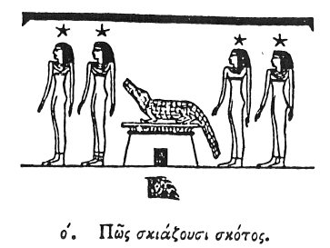

  
[Intangible Textual Heritage](../../index)  [Egypt](../index.md) 
[Index](index)  [Previous](hh071)  [Next](hh073.md) 

------------------------------------------------------------------------

[Buy this Book at
Amazon.com](https://www.amazon.com/exec/obidos/ASIN/1428631488/internetsacredte.md)

------------------------------------------------------------------------

*Hieroglyphics of Horapollo*, tr. Alexander Turner Cory, \[1840\], at
Intangible Textual Heritage

------------------------------------------------------------------------

p. 87

### LXX. HOW THEY SHADOW FORTH DARKNESS.

  [1](#fn_93.md)

To denote *darkness*, they represent the TAIL OF A CROCODILE, for by no
other means does the crocodile inflict death and destruction on any
animal which it may have caught, than by first striking it with its
tail, and rendering it incapable of motion: for in this part lies the
strength and power of the crocodile. And now, though there are other

p. 88

appropriate symbols deducible from the nature of the crocodile, those
which we have mentioned are sufficient for the first Book.

 

 

 

Τέλος τοῦ πρώτου βιβλίου.

END OF THE FIRST BOOK.

 

------------------------------------------------------------------------

### Footnotes

[87:1](hh072.htm#fr_98.md)

I. *The illustration is from Belzoni's tomb. There are properly 12
figures of each side of the crocodile; representing the hours of the day
and night*.

II\. *The fig. beneath certainly signifies darkness; and is supposed to
represent the end of a crocodile's tail*.

------------------------------------------------------------------------

[Next: Introduction](hh073.md)
