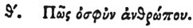

  
[Intangible Textual Heritage](../../index)  [Egypt](../index) 
[Index](index)  [Previous](hh082)  [Next](hh084) 

------------------------------------------------------------------------

[Buy this Book at
Amazon.com](https://www.amazon.com/exec/obidos/ASIN/1428631488/internetsacredte)

------------------------------------------------------------------------

*Hieroglyphics of Horapollo*, tr. Alexander Turner Cory, \[1840\], at
Intangible Textual Heritage

------------------------------------------------------------------------

### X. HOW THEY SYMBOLIZE PERMANENCY AND SAFETY.

  [1](#fn_98)

The BONE OF A QUAIL when delineated symbolizes permanency and safety;
because the bone of this animal is difficult to be affected.

------------------------------------------------------------------------

### Footnotes

[97:1](hh083.htm#fr_103)

I. *The quail*.

II\. *Signifies* "*Good*." Sh. 625.

III\. *Bone with flesh upon it is common*. *Probably* "*Son*." Sh. 1012.

------------------------------------------------------------------------

[Next: XI. How Concord](hh084)
