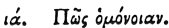

  
[Intangible Textual Heritage](../../index)  [Egypt](../index.md) 
[Index](index)  [Previous](hh083)  [Next](hh085.md) 

------------------------------------------------------------------------

[Buy this Book at
Amazon.com](https://www.amazon.com/exec/obidos/ASIN/1428631488/internetsacredte.md)

------------------------------------------------------------------------

*Hieroglyphics of Horapollo*, tr. Alexander Turner Cory, \[1840\], at
Intangible Textual Heritage

------------------------------------------------------------------------

p. 98

### XI. HOW CONCORD.

 

TWO MEN JOINING THEIR RIGHT HANDS denote *concord*.

------------------------------------------------------------------------

[Next: XII. How a Crowd](hh085.md)
