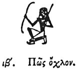

  
[Intangible Textual Heritage](../../index)  [Egypt](../index) 
[Index](index)  [Previous](hh084)  [Next](hh086) 

------------------------------------------------------------------------

[Buy this Book at
Amazon.com](https://www.amazon.com/exec/obidos/ASIN/1428631488/internetsacredte)

------------------------------------------------------------------------

*Hieroglyphics of Horapollo*, tr. Alexander Turner Cory, \[1840\], at
Intangible Textual Heritage

------------------------------------------------------------------------

### XII. HOW A CROWD.

  [1](#fn_99)

AN ARMED MAN SHOOTING WITH A BOW denotes a *crowd* \[troop or army?\]

------------------------------------------------------------------------

### Footnotes

[98:1](hh085.htm#fr_104) XII. *This signifies
soldiers*.—Sh. 988, 910. *Perhaps an army*. Sh.

------------------------------------------------------------------------

[Next: XIII. How Admeasurement](hh086)
