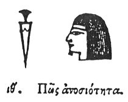

  
[Intangible Textual Heritage](../../index)  [Egypt](../index.md) 
[Index](index)  [Previous](hh091)  [Next](hh093.md) 

------------------------------------------------------------------------

[Buy this Book at
Amazon.com](https://www.amazon.com/exec/obidos/ASIN/1428631488/internetsacredte.md)

------------------------------------------------------------------------

*Hieroglyphics of Horapollo*, tr. Alexander Turner Cory, \[1840\], at
Intangible Textual Heritage

------------------------------------------------------------------------

p. 101

### XIX. HOW IMPIETY.

  [1](#fn_101.md)

A BUST portrayed WITH A SWORD denotes impiety.

------------------------------------------------------------------------

### Footnotes

[101:1](hh092.htm#fr_106.md)

XIX\. *Not ascertained*.

------------------------------------------------------------------------

[Next: XX. How an Hour \[Execration?\]](hh093.md)
