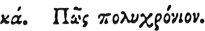

  
[Intangible Textual Heritage](../../index)  [Egypt](../index) 
[Index](index)  [Previous](hh093)  [Next](hh095) 

------------------------------------------------------------------------

[Buy this Book at
Amazon.com](https://www.amazon.com/exec/obidos/ASIN/1428631488/internetsacredte)

------------------------------------------------------------------------

*Hieroglyphics of Horapollo*, tr. Alexander Turner Cory, \[1840\], at
Intangible Textual Heritage

------------------------------------------------------------------------

p. 102

### XXI. How Anything of Long Duration.

  [1](#fn_104) [2](#fn_105)

A STAG shoots its horns every year, and when depicted, signifies
anything of *long duration*.

------------------------------------------------------------------------

### Footnotes

[102:1](hh094.htm#fr_109) XXI. *Several
inverted stags’ heads alternating with hieroglyphics, are delineated in
the judgment scene, where they seem to have some connexion with
duration, perhaps eternity. See Pl. 3. and B. I. c. 69*.

[102:2](hh094.htm#fr_110) Par. A. B. Pier
πολυχρόνια.

------------------------------------------------------------------------

[Next: XXII. How Aversion](hh095)
