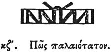

  
[Intangible Textual Heritage](../../index)  [Egypt](../index) 
[Index](index)  [Previous](hh099)  [Next](hh101) 

------------------------------------------------------------------------

[Buy this Book at
Amazon.com](https://www.amazon.com/exec/obidos/ASIN/1428631488/internetsacredte)

------------------------------------------------------------------------

*Hieroglyphics of Horapollo*, tr. Alexander Turner Cory, \[1840\], at
Intangible Textual Heritage

------------------------------------------------------------------------

p. 105

### XXVII. HOW THE MOST ANCIENT.

  [1](#fn_109)

WORDS AND LEAVES OF A SEALED BOOK denote *the most ancient*.

------------------------------------------------------------------------

### Footnotes

[105:1](hh100.htm#fr_114)

XXVII\. *The Papyri are found tied up, and sealed with clay above the
knot*.

------------------------------------------------------------------------

[Next: XXVIII. How a Siege](hh101)
