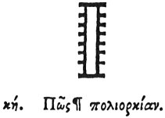

  
[Intangible Textual Heritage](../../index)  [Egypt](../index) 
[Index](index)  [Previous](hh100)  [Next](hh102) 

------------------------------------------------------------------------

[Buy this Book at
Amazon.com](https://www.amazon.com/exec/obidos/ASIN/1428631488/internetsacredte)

------------------------------------------------------------------------

*Hieroglyphics of Horapollo*, tr. Alexander Turner Cory, \[1840\], at
Intangible Textual Heritage

------------------------------------------------------------------------

### XXVIII. HOW A SIEGE.

  [2](#fn_110)

A LADDER signifies a *siege* by reason of its inequality \[?\].

p. 106

------------------------------------------------------------------------

### Footnotes

[105:2](hh101.htm#fr_115)

XXVIII\. *A kind of tower frequently found battle scenes*.

------------------------------------------------------------------------

[Next: XXIX. How Infinite, or a Song, or Fate](hh102)
