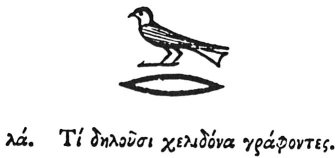

  
[Intangible Textual Heritage](../../index)  [Egypt](../index.md) 
[Index](index)  [Previous](hh103)  [Next](hh105.md) 

------------------------------------------------------------------------

[Buy this Book at
Amazon.com](https://www.amazon.com/exec/obidos/ASIN/1428631488/internetsacredte.md)

------------------------------------------------------------------------

*Hieroglyphics of Horapollo*, tr. Alexander Turner Cory, \[1840\], at
Intangible Textual Heritage

------------------------------------------------------------------------

p. 107

### XXXI. WHAT THEY DENOTE BY DEPICTING A SWALLOW.

  [1](#fn_115.md)

When they would signify that *the whole of a parent's substance has been
left to the sons*, they depict a SWALLOW. For she rolls herself in the
mud, and builds a nest for her young, when she is herself about to die.

------------------------------------------------------------------------

### Footnotes

[107:1](hh104.htm#fr_120.md)

XXXI\. *Jewels, valuables*. Sh. 551.

------------------------------------------------------------------------

[Next: XXXII. What by a Black Dove](hh105.md)
