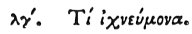

  
[Intangible Textual Heritage](../../index)  [Egypt](../index.md) 
[Index](index)  [Previous](hh105)  [Next](hh107.md) 

------------------------------------------------------------------------

[Buy this Book at
Amazon.com](https://www.amazon.com/exec/obidos/ASIN/1428631488/internetsacredte.md)

------------------------------------------------------------------------

*Hieroglyphics of Horapollo*, tr. Alexander Turner Cory, \[1840\], at
Intangible Textual Heritage

------------------------------------------------------------------------

p. 108

### XXXIII. WHAT BY AN ICHNEUMON.

 

When they would represent *a man that is feeble, and unable of himself
to help himself, but who does so by the aid of others*, they delineate
an ICHNEUMON. For this animal, when it spies a serpent, does not at once
attack it, but by its noise calls others to its assistance, and then
attacks the serpent.

------------------------------------------------------------------------

[Next: XXXIV. What They Denote by Engraving Origanum (Wild Marjoram) for
a Hieroglyphic](hh107.md)
