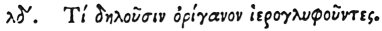

  
[Intangible Textual Heritage](../../index)  [Egypt](../index.md) 
[Index](index)  [Previous](hh106)  [Next](hh108.md) 

------------------------------------------------------------------------

[Buy this Book at
Amazon.com](https://www.amazon.com/exec/obidos/ASIN/1428631488/internetsacredte.md)

------------------------------------------------------------------------

*Hieroglyphics of Horapollo*, tr. Alexander Turner Cory, \[1840\], at
Intangible Textual Heritage

------------------------------------------------------------------------

### XXXIV. WHAT THEY DENOTE BY ENGRAVING ORIGANUM (WILD MARJORAM) FOR A HIEROGLYPHIC.

 

When they would symbolise the *departure of ants*, they engrave
ORIGANUM. For if this plant be laid down over the spot from whence the
ants issue forth, it causes them to desert it.

------------------------------------------------------------------------

[Next: XXXV. What by a Scorpion and Crocodile](hh108.md)
