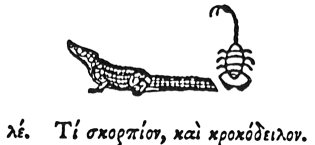

  
[Intangible Textual Heritage](../../index)  [Egypt](../index.md) 
[Index](index)  [Previous](hh107)  [Next](hh109.md) 

------------------------------------------------------------------------

[Buy this Book at
Amazon.com](https://www.amazon.com/exec/obidos/ASIN/1428631488/internetsacredte.md)

------------------------------------------------------------------------

*Hieroglyphics of Horapollo*, tr. Alexander Turner Cory, \[1840\], at
Intangible Textual Heritage

------------------------------------------------------------------------

p. 109

### XXXV. WHAT BY A SCORPION AND CROCODILE.

  [1](#fn_116.md)

When they would symbolise *one enemy engaging with another equal to
himself*, they depict a SCORPION AND A CROCODILE. For these kill one
another. But if they would symbolise *one who is hostile to, and has
slain another*, they depict a CROCODILE or a SCORPION; and if he has
slain him *speedily*, they depict a CROCODILE, but if *slowly*, a
SCORPION, from its tardy motion.

------------------------------------------------------------------------

### Footnotes

[109:1](hh108.htm#fr_121.md)

XXXV\. *This seems to hare some astronomical allusion. The Crocodile was
one of the Vahans of the Sun, and the year began with Scorpio. It is not
an uncommon hieroglyphic*.

------------------------------------------------------------------------

[Next: XXXVI. What by a Weasel](hh109.md)
