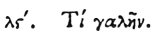

  
[Intangible Textual Heritage](../../index)  [Egypt](../index.md) 
[Index](index)  [Previous](hh108)  [Next](hh110.md) 

------------------------------------------------------------------------

[Buy this Book at
Amazon.com](https://www.amazon.com/exec/obidos/ASIN/1428631488/internetsacredte.md)

------------------------------------------------------------------------

*Hieroglyphics of Horapollo*, tr. Alexander Turner Cory, \[1840\], at
Intangible Textual Heritage

------------------------------------------------------------------------

p. 110

### XXXVI. WHAT BY A WEASEL.

 

When they would symbolise *a woman performing the works of a man*, they
depict a WEASEL; quod maris pudendum habeat velut ossiculum.

------------------------------------------------------------------------

[Next: XXXVII. What by a Hog](hh110.md)
