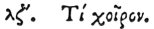

  
[Intangible Textual Heritage](../../index)  [Egypt](../index) 
[Index](index)  [Previous](hh109)  [Next](hh111) 

------------------------------------------------------------------------

[Buy this Book at
Amazon.com](https://www.amazon.com/exec/obidos/ASIN/1428631488/internetsacredte)

------------------------------------------------------------------------

*Hieroglyphics of Horapollo*, tr. Alexander Turner Cory, \[1840\], at
Intangible Textual Heritage

------------------------------------------------------------------------

### XXXVII. WHAT BY A HOG. [1](#fn_117)

 

When they would symbolise a filthy man, they depict a HOG; from such
being the nature of the hog.

------------------------------------------------------------------------

### Footnotes

[110:1](hh110.htm#fr_122)

XXXVII\. *There is an example of a hog in a judgment scene in the tombs
of the kings, where, according to Champollion, it denotes the
metampsychosis of a glutton condemned by Osiris into a hog: Bonomi*.
*See Pl*. 3.

------------------------------------------------------------------------

[Next: XXXVIII. How Immoderate Anger](hh111)
