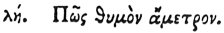

  
[Intangible Textual Heritage](../../index)  [Egypt](../index.md) 
[Index](index)  [Previous](hh110)  [Next](hh112.md) 

------------------------------------------------------------------------

[Buy this Book at
Amazon.com](https://www.amazon.com/exec/obidos/ASIN/1428631488/internetsacredte.md)

------------------------------------------------------------------------

*Hieroglyphics of Horapollo*, tr. Alexander Turner Cory, \[1840\], at
Intangible Textual Heritage

------------------------------------------------------------------------

p. 111

### XXXVIII. HOW IMMODERATE ANGER.

 

If they would represent *immoderate anger*, so that he who is angry
takes a fever thereby, they depict a LION BREAKING THE BONES OF ITS OWN
WHELPS. And they portray the lion to signify anger, and the whelps
having their bones broken, because the bones of the whelps when struck
together emit sparks of fire.

------------------------------------------------------------------------

[Next: XXXIX. How an Old Minstrel](hh112.md)
