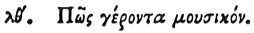

  
[Intangible Textual Heritage](../../index)  [Egypt](../index) 
[Index](index)  [Previous](hh111)  [Next](hh113) 

------------------------------------------------------------------------

[Buy this Book at
Amazon.com](https://www.amazon.com/exec/obidos/ASIN/1428631488/internetsacredte)

------------------------------------------------------------------------

*Hieroglyphics of Horapollo*, tr. Alexander Turner Cory, \[1840\], at
Intangible Textual Heritage

------------------------------------------------------------------------

### XXXIX. HOW AN OLD MINSTREL.

 

When they would symbolise an *old minstrel*, they depict a SWAN, for
when old it sings the sweetest melody.

------------------------------------------------------------------------

[Next: XL. How They Denote a Man Who Lives with his Wife](hh113)
