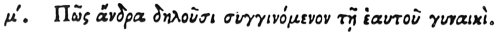

  
[Intangible Textual Heritage](../../index)  [Egypt](../index) 
[Index](index)  [Previous](hh112)  [Next](hh114) 

------------------------------------------------------------------------

[Buy this Book at
Amazon.com](https://www.amazon.com/exec/obidos/ASIN/1428631488/internetsacredte)

------------------------------------------------------------------------

*Hieroglyphics of Horapollo*, tr. Alexander Turner Cory, \[1840\], at
Intangible Textual Heritage

------------------------------------------------------------------------

p. 112

### XL. HOW THEY DENOTE A MAN WHO LIVES WITH HIS WIFE.

 

When they would symbolise *a man living in intercourse with his own
wife*, they depict TWO CROWS; for these birds cohabit with one another
in the same manner as does a man by nature.

------------------------------------------------------------------------

[Next: XLI. What They Intimate by Pourtraying a Blind Beetle](hh114)
