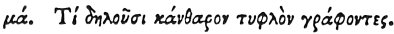

  
[Intangible Textual Heritage](../../index)  [Egypt](../index.md) 
[Index](index)  [Previous](hh113)  [Next](hh115.md) 

------------------------------------------------------------------------

[Buy this Book at
Amazon.com](https://www.amazon.com/exec/obidos/ASIN/1428631488/internetsacredte.md)

------------------------------------------------------------------------

*Hieroglyphics of Horapollo*, tr. Alexander Turner Cory, \[1840\], at
Intangible Textual Heritage

------------------------------------------------------------------------

### XLI. WHAT THEY INTIMATE BY POURTRAYING A BLIND BEETLE.

 

When they would symbolise *a man who has caught a fever from a stroke of
the sun, and died in consequence*, they portray a BLIND BEETLE; for this
creature dies after it has been blinded by the sun.

------------------------------------------------------------------------

[Next: XLII. What They Design by Depicting a Mule](hh115.md)
