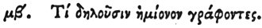

  
[Intangible Textual Heritage](../../index)  [Egypt](../index.md) 
[Index](index)  [Previous](hh114)  [Next](hh116.md) 

------------------------------------------------------------------------

[Buy this Book at
Amazon.com](https://www.amazon.com/exec/obidos/ASIN/1428631488/internetsacredte.md)

------------------------------------------------------------------------

*Hieroglyphics of Horapollo*, tr. Alexander Turner Cory, \[1840\], at
Intangible Textual Heritage

------------------------------------------------------------------------

p. 113

### XLII. WHAT THEY DESIGN BY DEPICTING A MULE.

 

When they would symbolise *a barren woman*, they delineate a MULE; for
this animal is barren, quod matricem rectam non habet.

------------------------------------------------------------------------

[Next: XLIII. How They Denote a Woman who has Brought Forth Female
Infants](hh116.md)
