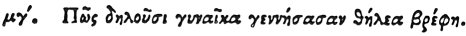

  
[Intangible Textual Heritage](../../index)  [Egypt](../index.md) 
[Index](index)  [Previous](hh115)  [Next](hh117.md) 

------------------------------------------------------------------------

[Buy this Book at
Amazon.com](https://www.amazon.com/exec/obidos/ASIN/1428631488/internetsacredte.md)

------------------------------------------------------------------------

*Hieroglyphics of Horapollo*, tr. Alexander Turner Cory, \[1840\], at
Intangible Textual Heritage

------------------------------------------------------------------------

### XLIII. HOW THEY DENOTE A WOMAN WHO HAS BROUGHT FORTH FEMALE INFANTS.

 

When they would symbolise a woman who has brought forth female infants
first, they delineate a BULL INCLINING TOWARDS THE LEFT: and again if
male infants, then they delineate a BULL inclining to the right. Is enim
ex congressu discedens, si ad lævam

p. 114

conversus fuerit, genitam esse fœminam indicat, si ad dexteram marem.

------------------------------------------------------------------------

[Next: XLIV. How They Denote Wasps](hh117.md)
