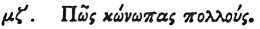

  
[Intangible Textual Heritage](../../index)  [Egypt](../index) 
[Index](index)  [Previous](hh119)  [Next](hh121) 

------------------------------------------------------------------------

[Buy this Book at
Amazon.com](https://www.amazon.com/exec/obidos/ASIN/1428631488/internetsacredte)

------------------------------------------------------------------------

*Hieroglyphics of Horapollo*, tr. Alexander Turner Cory, \[1840\], at
Intangible Textual Heritage

------------------------------------------------------------------------

### XLVII. HOW A SWARM OF GNATS.

 

When they would represent *many gnats swarming together*, they depict
MAGGOTS; for from them gnats are engendered.

------------------------------------------------------------------------

[Next: XLVIII. How a Man That Has No Bile, But Receives It From
Another](hh121)
