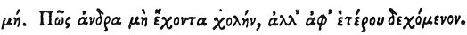

  
[Intangible Textual Heritage](../../index)  [Egypt](../index) 
[Index](index)  [Previous](hh120)  [Next](hh122) 

------------------------------------------------------------------------

[Buy this Book at
Amazon.com](https://www.amazon.com/exec/obidos/ASIN/1428631488/internetsacredte)

------------------------------------------------------------------------

*Hieroglyphics of Horapollo*, tr. Alexander Turner Cory, \[1840\], at
Intangible Textual Heritage

------------------------------------------------------------------------

p. 116

### XLVIII. HOW A MAN THAT HAS NO BILE, BUT RECEIVES IT FROM ANOTHER.

 

When they would symbolise *a man who has naturally no bile but receives
it from another*, they depict a DOVE WITH HER HINDER PARTS ERECT; for in
them she has her bile.

------------------------------------------------------------------------

[Next: XLIX. How a Man Who Dwells Securely in a City](hh122)
