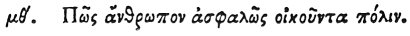

  
[Intangible Textual Heritage](../../index)  [Egypt](../index.md) 
[Index](index)  [Previous](hh121)  [Next](hh123.md) 

------------------------------------------------------------------------

[Buy this Book at
Amazon.com](https://www.amazon.com/exec/obidos/ASIN/1428631488/internetsacredte.md)

------------------------------------------------------------------------

*Hieroglyphics of Horapollo*, tr. Alexander Turner Cory, \[1840\], at
Intangible Textual Heritage

------------------------------------------------------------------------

### XLIX. HOW A MAN WHO DWELLS SECURELY IN A CITY.

 

When they would symbolise *a man who dwells securely in a city*, they
depict an EAGLE CONVEYING A STONE; for he takes up a stone, either from
the sea or land, and deposits it in his nest, to keep it steady.

------------------------------------------------------------------------

[Next: L. How a Man Who is Weak and Persecuted by Another](hh123.md)
