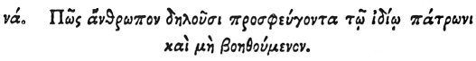

  
[Intangible Textual Heritage](../../index)  [Egypt](../index.md) 
[Index](index)  [Previous](hh123)  [Next](hh125.md) 

------------------------------------------------------------------------

[Buy this Book at
Amazon.com](https://www.amazon.com/exec/obidos/ASIN/1428631488/internetsacredte.md)

------------------------------------------------------------------------

*Hieroglyphics of Horapollo*, tr. Alexander Turner Cory, \[1840\], at
Intangible Textual Heritage

------------------------------------------------------------------------

### LI. HOW THEY DENOTE A MAN WHO FLEES FOR REFUGE TO HIS PATRON, AND RECEIVES NO ASSISTANCE.

 

When they would denote *a man who flees for refuge to his patron, and
receives no assistance*, they depict a SPARROW AND AN OWL; for the
sparrow when pursued betakes itself to the owl, and being near it is
seized.

p. 118

------------------------------------------------------------------------

[Next: LII. How They Represent a Weak Man That is Audacious](hh125.md)
