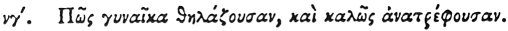

  
[Intangible Textual Heritage](../../index)  [Egypt](../index) 
[Index](index)  [Previous](hh125)  [Next](hh127) 

------------------------------------------------------------------------

[Buy this Book at
Amazon.com](https://www.amazon.com/exec/obidos/ASIN/1428631488/internetsacredte)

------------------------------------------------------------------------

*Hieroglyphics of Horapollo*, tr. Alexander Turner Cory, \[1840\], at
Intangible Textual Heritage

------------------------------------------------------------------------

### LIII. HOW A WOMAN SUCKLING AND BRINGING UP HER CHILDREN WELL.

 

When they would represent *a woman suckling and bringing up her children
well*, they again portray a BAT WITH TEETH AND BREASTS; for this is the
only winged creature which has teeth and breasts.

------------------------------------------------------------------------

[Next: LIV. How a Man Fond of Dancing](hh127)
