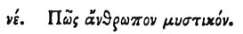

  
[Intangible Textual Heritage](../../index)  [Egypt](../index) 
[Index](index)  [Previous](hh127)  [Next](hh129) 

------------------------------------------------------------------------

[Buy this Book at
Amazon.com](https://www.amazon.com/exec/obidos/ASIN/1428631488/internetsacredte)

------------------------------------------------------------------------

*Hieroglyphics of Horapollo*, tr. Alexander Turner Cory, \[1840\], at
Intangible Textual Heritage

------------------------------------------------------------------------

### LV. HOW A MYSTIC MAN.

 

When they would symbolise *a mystic man, and one initiated*, they
delineate a GRASSHOPPER; for he does not utter sounds through his mouth,
but chirping by means of his spine, sings a sweet melody.

------------------------------------------------------------------------

[Next: LVI. How a King who Keeps Himself Apart, and Shews No Mercy to
Delinquencies](hh129)
