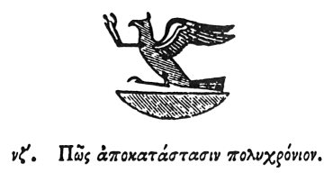

  
[Intangible Textual Heritage](../../index)  [Egypt](../index) 
[Index](index)  [Previous](hh129)  [Next](hh131) 

------------------------------------------------------------------------

[Buy this Book at
Amazon.com](https://www.amazon.com/exec/obidos/ASIN/1428631488/internetsacredte)

------------------------------------------------------------------------

*Hieroglyphics of Horapollo*, tr. Alexander Turner Cory, \[1840\], at
Intangible Textual Heritage

------------------------------------------------------------------------

p. 121

### LVII. HOW THE GREAT CYCLICAL RENOVATION.

  [1](#fn_121)

When they would denote *the great cyclical renovation*, they portray the
bird PHŒNIX. For when he is produced a renovation of things takes place,
and he is produced in this manner. When the Phœnix is about to die, he
casts himself vehemently upon the ground, and is wounded by the blow,
and from the ichor, which flows from the wound, another phœnix is
produced; which as soon as it is fledged, goes with his father to the
city of the sun in Egypt; who when he is come thither, dies in that
place at the rising of

p. 122

the sun. And after the death of his father, the young one departs again
to his own country; and the priests of Egypt bury the phœnix that is
dead.

------------------------------------------------------------------------

### Footnotes

[121:1](hh130.htm#fr_126)

*Phœnix*.

------------------------------------------------------------------------

[Next: LVIII. How One Who is Fond of His Father](hh131)
