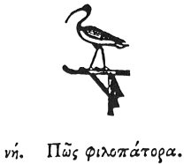

  
[Intangible Textual Heritage](../../index)  [Egypt](../index.md) 
[Index](index)  [Previous](hh130)  [Next](hh132.md) 

------------------------------------------------------------------------

[Buy this Book at
Amazon.com](https://www.amazon.com/exec/obidos/ASIN/1428631488/internetsacredte.md)

------------------------------------------------------------------------

*Hieroglyphics of Horapollo*, tr. Alexander Turner Cory, \[1840\], at
Intangible Textual Heritage

------------------------------------------------------------------------

### LVIII. HOW ONE WHO IS FOND OF HIS FATHER.

  [1](#fn_122.md)

When they would denote *a man fond of his father*, they depict a STORK;
for after he has been brought up by his parents he departs not from
them, but remains with them to the end of their life, taking upon
himself the care of them.

------------------------------------------------------------------------

### Footnotes

[122:1](hh131.htm#fr_127.md)

*Thoth*.

------------------------------------------------------------------------

[Next: LIX. How a Woman That Hates Her Husband](hh132.md)
