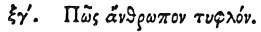

  
[Intangible Textual Heritage](../../index)  [Egypt](../index) 
[Index](index)  [Previous](hh135)  [Next](hh137) 

------------------------------------------------------------------------

[Buy this Book at
Amazon.com](https://www.amazon.com/exec/obidos/ASIN/1428631488/internetsacredte)

------------------------------------------------------------------------

*Hieroglyphics of Horapollo*, tr. Alexander Turner Cory, \[1840\], at
Intangible Textual Heritage

------------------------------------------------------------------------

### LXIII. HOW A BLIND MAN.

 

When they would symbolise *a blind man*, they depict a MOLE; for it
neither has eyes, nor does it see.

------------------------------------------------------------------------

[Next: LXIV. How a Man That Never Stirs Out](hh137)
