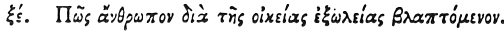

  
[Intangible Textual Heritage](../../index)  [Egypt](../index.md) 
[Index](index)  [Previous](hh137)  [Next](hh139.md) 

------------------------------------------------------------------------

[Buy this Book at
Amazon.com](https://www.amazon.com/exec/obidos/ASIN/1428631488/internetsacredte.md)

------------------------------------------------------------------------

*Hieroglyphics of Horapollo*, tr. Alexander Turner Cory, \[1840\], at
Intangible Textual Heritage

------------------------------------------------------------------------

### LXV. HOW A MAN WHO IS INJURED BY SELF-INFLICTIONS.

 

When they would symbolise *a man injured by self inflictions*, they
delineate a BEAVER; for when pursued he tears out his own testicles, and
casts them as spoil to his pursuers.

------------------------------------------------------------------------

[Next: LXVI. How a Man Who Has Been Succeeded in His Property by a Son
Whom He Hated](hh139.md)
