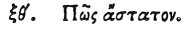

  
[Intangible Textual Heritage](../../index)  [Egypt](../index.md) 
[Index](index)  [Previous](hh141)  [Next](hh143.md) 

------------------------------------------------------------------------

[Buy this Book at
Amazon.com](https://www.amazon.com/exec/obidos/ASIN/1428631488/internetsacredte.md)

------------------------------------------------------------------------

*Hieroglyphics of Horapollo*, tr. Alexander Turner Cory, \[1840\], at
Intangible Textual Heritage

------------------------------------------------------------------------

### LXIX. HOW AN UNSETTLED PERSON.

 

When they would symbolise *one that is unsettled*, and that does not
remain in the same state, but is sometimes strong, and at other times
weak, they depict an HYÆNA; for this creature is at times male, and at
times female. [1](#fn_124.md)

------------------------------------------------------------------------

### Footnotes

[128:1](hh142.htm#fr_129.md) The Arabs still
believe this to be the case.

------------------------------------------------------------------------

[Next: LXIX. How a Man Overcome by his Inferiors](hh143.md)
