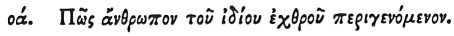

  
[Intangible Textual Heritage](../../index)  [Egypt](../index) 
[Index](index)  [Previous](hh143)  [Next](hh145) 

------------------------------------------------------------------------

[Buy this Book at
Amazon.com](https://www.amazon.com/exec/obidos/ASIN/1428631488/internetsacredte)

------------------------------------------------------------------------

*Hieroglyphics of Horapollo*, tr. Alexander Turner Cory, \[1840\], at
Intangible Textual Heritage

------------------------------------------------------------------------

### LXX. HOW A MAN WHO OVERCOMES HIS PRIVATE ENEMY [2](#fn_126).

 

To denote *a man who overcomes his private enemy*, they

p. 130

delineate an HYÆNA TURNING TO THE RIGHT; but if *himself overcome*, they
on the contrary depict ONE TURNING TO THE LEFT; for should this animal,
when pursued, turn to the right, it slays the pursuer, but if to the
left, it is slain by the pursuer.

------------------------------------------------------------------------

### Footnotes

[129:2](hh144.htm#fr_131)

LXX\. *See the skin placed before Osiris, B. I. c.* 40*. The skin is in
some manner connected with judgment and protection, but it is not yet
well understood*.

------------------------------------------------------------------------

[Next: LXXII. How a Man Who Passes Fearlessly Through the Evils Which
Assail Him](hh145)
