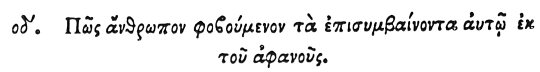

  
[Intangible Textual Heritage](../../index)  [Egypt](../index) 
[Index](index)  [Previous](hh146)  [Next](hh148) 

------------------------------------------------------------------------

[Buy this Book at
Amazon.com](https://www.amazon.com/exec/obidos/ASIN/1428631488/internetsacredte)

------------------------------------------------------------------------

*Hieroglyphics of Horapollo*, tr. Alexander Turner Cory, \[1840\], at
Intangible Textual Heritage

------------------------------------------------------------------------

p. 132

### LXXIV. HOW A MAN WHO IS FEARFUL LEST ACCIDENTS SHOULD HAPPEN UNEXPECTEDLY TO HIMSELF.

 

When they would denote a man who is fearful lest accidents should happen
unexpectedly to himself, they depict a WOLF AND A STONE; for it fears
neither iron, nor a stick, but a stone only; and indeed, if any one
throw a stone at him he will find him terrified: and wherever a wolf is
struck by a stone, maggots are engendered from the bruise.

------------------------------------------------------------------------

[Next: LXXV. How a Man Calmed by Fire During Anger](hh148)
