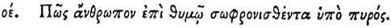

  
[Intangible Textual Heritage](../../index)  [Egypt](../index) 
[Index](index)  [Previous](hh147)  [Next](hh149) 

------------------------------------------------------------------------

[Buy this Book at
Amazon.com](https://www.amazon.com/exec/obidos/ASIN/1428631488/internetsacredte)

------------------------------------------------------------------------

*Hieroglyphics of Horapollo*, tr. Alexander Turner Cory, \[1840\], at
Intangible Textual Heritage

------------------------------------------------------------------------

### LXXV. HOW A MAN CALMED BY FIRE DURING ANGER.

  [1](#fn_129)

When they would denote *a man calmed by fire even during* 

p. 133

*anger*, they portray LIONS AND TORCHES; for the lion dreads nothing so
much as lighted torches, and is tamed by nothing so readily as by them.

------------------------------------------------------------------------

### Footnotes

[132:1](hh148.htm#fr_134) Treb. igne castigatum
"chastised by fire."

------------------------------------------------------------------------

[Next: LXXVI. How a Feverish Man Who Cures Himself](hh149)
