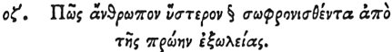

  
[Intangible Textual Heritage](../../index)  [Egypt](../index) 
[Index](index)  [Previous](hh149)  [Next](hh151) 

------------------------------------------------------------------------

[Buy this Book at
Amazon.com](https://www.amazon.com/exec/obidos/ASIN/1428631488/internetsacredte)

------------------------------------------------------------------------

*Hieroglyphics of Horapollo*, tr. Alexander Turner Cory, \[1840\], at
Intangible Textual Heritage

------------------------------------------------------------------------

### LXXVII. HOW A MAN WHO BECOMES STEADY AT LAST AFTER HIS FORMER EXCESSES.

  [1](#fn_130)

When they would denote *a man who after his former* 

p. 134

*excesses at length becomes steady*, they portray a BULL BOUND ABOUT BY
A WILD FIG BRANCH; for if when violent he is bound with a wild fig
branch, he becomes gentle.

------------------------------------------------------------------------

### Footnotes

[133:1](hh150.htm#fr_135) Treb. renders,
novissima calamitate castigatum, "chastised by a very recent calamity."

------------------------------------------------------------------------

[Next: LXXVIII. How a Man Whose Temperance is Easily Changed](hh151)
