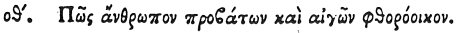

  
[Intangible Textual Heritage](../../index)  [Egypt](../index.md) 
[Index](index)  [Previous](hh151)  [Next](hh153.md) 

------------------------------------------------------------------------

[Buy this Book at
Amazon.com](https://www.amazon.com/exec/obidos/ASIN/1428631488/internetsacredte.md)

------------------------------------------------------------------------

*Hieroglyphics of Horapollo*, tr. Alexander Turner Cory, \[1840\], at
Intangible Textual Heritage

------------------------------------------------------------------------

p. 135

### LXXIX. HOW A SLAYER OF SHEEP AND GOATS.

 

When they would symbolise *a slayer of sheep and goats*, they portray
THESE ANIMALS EATING FLEABANE; for if they eat fleabane they die, being
cut off by thirst.

------------------------------------------------------------------------

[Next: LXXX. How They Denote a Man Eating](hh153.md)
